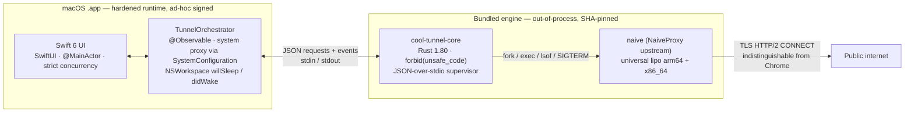

<div align="center">

# Cool Tunnel

**A non-custodial macOS client for borderless, surveillance-resistant communication.**

*Transparency over profit. Freedom over control.*

[](./LICENSE)
[](https://github.com/coo1white/cool-tunnel/releases/latest)
[](#compatibility)
[](https://github.com/coo1white/cool-tunnel/actions/workflows/ci.yml)
[](./core)
[](#compatibility)

</div>

---

## ⚖️ Manifesto

Digital borders are policy, not topology. Surveillance is a posture, not an inevitability. Cool Tunnel exists because the right to private, undirected communication is older than the networks that mediate it.

We do not run a service. We publish a tool, sign no certificate of trust, host no user state, and operate no fleet. The user is sovereign. The protocol is the only authority.

> **Read this first.** This software has the technical capability to circumvent network restrictions. The [Disclaimer](./Disclaimer.md) covers what it is for, what it is not for, and the rules you should know before installing. By installing, you agree you have read it.

---

## Architecture Blueprint

The client is three independently-built artefacts cooperating across two trust boundaries. The boundary between Swift and Rust is a **process boundary**, not an FFI; the boundary between Rust and `naive` is the same. Each layer can crash, be replaced, or be re-signed without dragging the others down.



### Why a process boundary, not an FFI

| Concern | What the boundary buys |
|---|---|
| **Crash isolation** | A panic in `cool-tunnel-core` terminates one subprocess. The orchestrator detects `SIGCHLD`, classifies the failure into one of `.local` / `.upstream` / `.vps`, and offers re-launch. The user's window does not vanish. |
| **Memory safety, transitively** | `core/` carries `#![forbid(unsafe_code)]` at the crate root and supervises a *separate* `naive` binary. Compromise of the data plane cannot reach into the orchestrator's address space. |
| **Reproducibility** | Three independently SHA-pinned artefacts: the Swift `.app`, the Rust `cool-tunnel-core`, and the bundled `naive`. Each is rebuildable in isolation; the in-app updater rotates each on its own cadence. |
| **Determinism on the wire** | The JSON schema *is* the contract. There is no shared memory, no version-coupled struct layout, no `Sendable`-vs-`Send` disagreement to debug across an FFI. Either side can be replaced by a process speaking the same JSON. |
| **Strict concurrency** | Swift 6 strict-concurrency (`@MainActor` UI, actor-isolated orchestrator) sits cleanly above an asynchronous Tokio supervisor — neither has to model the other's executor. |

The Rust core is a **subprocess supervisor + JSON dispatcher + log redactor + anomaly monitor**. It does not route packets. Packet shaping is `naive`'s job; the supervisor's job is to make sure `naive` is healthy, bound only to `127.0.0.1`, and that its logs do not leak credentials.

---

## ⚓ The Covenant — LTSC-Heng License Summary

This software ships under the **GNU Affero General Public License v3, no-or-later qualifier (AGPL-3.0-only)**. Copyright © 2026 coolwhite LLC. The covenant binds three properties simultaneously — long-term-servicing constancy (LTSC), engineering Heng, and the AGPL hard-copyleft floor.

### 1 — Source-availability (AGPL § 13)

| You may | You must |
|---|---|
| Use, study, modify, redistribute the source | Preserve the licence and source-availability |
| Run private modifications without disclosure | (no obligation while the modification stays private) |
| Operate a modified version as a network service | Publish those modifications under AGPL-3.0 to every user of that service |
| Sell, package, or vendor the source | Preserve the licence; charge for service, not the gift |

§ 13 is not a fence. It is the guarantee that no future hand can take this code from the commons.

### 2 — Strict no-warranty, strict no-liability (AGPL §§ 15–17)

The software is provided **"AS IS", without warranty of any kind**, express or implied — merchantability, fitness for a particular purpose, non-infringement, and circumvention efficacy are explicitly disclaimed. To the maximum extent permitted by applicable law, in no event will any copyright holder or contributor be liable for damages arising from use, including loss of data, profits, or any consequential damages, even if advised of the possibility.

If you operate this software in a jurisdiction where its capabilities are restricted, **the legal exposure is yours, not ours.** [Disclaimer.md](./Disclaimer.md) is the operator's read-this-first.

### 3 — Anti-commercial-misappropriation

The covenant explicitly admits commercial use, but admits *only* commercial use that respects § 13:

- **Permitted** — consultancy, custom integration, packaging service, audits, support contracts. Anything where the **service** is the product.
- **Permitted** — redistributing the source under AGPL-3.0-only with full attribution.
- **Refused** — relicensing under any non-copyleft licence. coolwhite LLC does not grant proprietary forks. There is no CLA, no contributor licence assignment, no rights-aggregation. The repo is a covenant, not an acquisition pipeline.
- **Refused** — "open core" repackaging that hides modifications behind a closed network service. § 13 is unambiguous on this point.

### Prospective licensing

Every release tagged on or before `v2.0.25` was distributed under Apache-2.0 and remains available under that licence to anyone who downloaded it. AGPL-3.0-only applies prospectively from `v2.0.26`. The licence change is not retroactive.

---

## 🛡️ Heng — Constancy over Feature Velocity

Roadmaps invite scope creep. We practise *Heng* — constancy. Releases ship on what we cannot leave in the field, not on what we could demonstrate at a keynote.

| What we ship on | What we do not ship on |
|---|---|
| Reproducibility regressions | Marketing dates |
| Operator-reported defects | Influencer roadmaps |
| Audit-cycle findings | Feature-velocity targets |
| Upstream protocol drift | "Innovation theatre" |

Each release is a fix or an architectural correction. Each release is reproducible from public source via `cargo build --locked` + `xcodebuild`. Every prior release remains downloadable and independently buildable.

---

## Protocol is Truth

We do not ask for trust. We make trust unnecessary.

| Property | Mechanism |
|---|---|
| Indistinguishable transport | NaiveProxy traffic is the wire-shape of Chrome talking to a regular HTTPS site. No fingerprint a network observer can attribute to the proxy class. |
| No central authority | No telemetry, no identity service, no key registry. The connection is a function of *your* server and *your* credentials. |
| Reproducible binary | Every release is buildable bit-for-bit from public source. The signed `.app` corresponds to a public commit. |
| Pinned updates | The in-app updater verifies SHA-256 against a published manifest before adopting any new binary. |
| Hardened runtime + ad-hoc signature | Library-injection blocked at runtime; the App is signed with our own key (no Apple Developer subscription required for the project to ship). |

The protocol is the contract. The contract is verifiable. We are not asking for your trust; we are showing you our work.

---

## ⚡ Quick Start

A non-technical user can finish in one sitting.

### Step 1 — Download the latest `.dmg`

Go to **[github.com/coo1white/cool-tunnel/releases/latest][releases]**. Pick the **`Cool-tunnel-v2.0.x.dmg`** asset.

### Step 2 — Drag into Applications

Double-click the `.dmg`. Drag the Cool Tunnel icon onto the **Applications** folder shortcut.

### Step 3 — First launch (one-time approval)

Open `/Applications`, find **Cool Tunnel**, and **right-click → Open**. Click **Open** in the dialog macOS shows. After that, normal launch every time. Required because the app is signed with our key, not Apple's $99-per-year Developer ID — the right-click gesture is the user-side trust acknowledgement.

### Step 4 — Configure your server

You need a NaiveProxy server somewhere on the internet. Fill in the address, username, and password. Leave **Local Port** at `1080` unless you have a reason. Without a server: spin one up via [`coo1white/cool-tunnel-server`](https://github.com/coo1white/cool-tunnel-server) — Debian + Docker, ~15 minutes.

### Step 5 — Pick a mode

| Mode | When |
| --- | --- |
| **Smart** | Most of the time. Routes blocked sites through your server, lets local sites skip the proxy for speed. |
| **Global** | Maximum privacy — every TCP connection through your server. |
| **Local** | Listens on `127.0.0.1:1080` without altering system network settings. For pointing one specific app at the proxy. |

Status pill at the top turns pink and pulses; that means it is working.

[releases]: https://github.com/coo1white/cool-tunnel/releases/latest

---

## Build From Source — Synthetic CI Gate

The project ships without a paid Apple Developer subscription, which means no Xcode Cloud, no notarisation, no managed CI runners. The `scripts/` shell tooling substitutes for all three: every check the project would otherwise gate behind a cloud build runs locally, deterministically, before a release artefact is allowed to leave the working tree.

### First Scold — strict prerequisites

`scripts/preflight.sh` will refuse to run if any of these are missing or out of band. Install them once; the script will tell you precisely which one is wrong.

| Tool | Required | Install |
|---|---|---|
| Xcode | 15.0 + (Swift 6 mode) | App Store |
| Rust toolchain | pinned by `rust-toolchain.toml` (1.80) | `rustup show` fetches the pin automatically |
| `swift-format` | bundled with Xcode | `xcrun swift-format --version` to verify |
| `cargo-deny` | latest | `cargo install cargo-deny --locked` |
| `shellcheck` | any recent | `brew install shellcheck` |
| `gh` | for release publish (optional) | `brew install gh` |

### Then Do Good — one command

```bash
git clone https://github.com/coo1white/cool-tunnel.git
cd cool-tunnel
bash scripts/cut_release.sh 2.0.30
```

That single invocation runs, in order:

1. **`preflight.sh`** — `cargo fmt --check`, `cargo clippy -D warnings`, `cargo deny check`, `cargo test --locked`, `swift-format lint --strict`, `xcodebuild test`, lipo arch guard, schema sync probe.
2. **Clean rebuild** — `cargo clean` inside `core/`, `cargo update -p cool-tunnel-core`, `xcodebuild Release` for the universal `.app`.
3. **`security_check.sh`** — 24 invariants: bundle layout, code-sign verification (deep, strict) on every embedded Mach-O, universal-binary check, NaiveProxy SHA-256 against `naive.upstream.json`, `Info.plist` `CFBundleShortVersionString` match, secret-pattern scan, AGPL/NOTICE/Disclaimer presence, entitlements review, LTSC posture (`Cargo.lock`, `rust-toolchain.toml`, `SUPPORT.md`).
4. **`package_release.sh`** — writes `dist/Cool-tunnel-vX.Y.Z.{dmg,pkg,zip}`, the universal `cool-tunnel-core-vX.Y.Z-universal` core binary, and `Cool-tunnel-vX.Y.Z.sha256` (the manifest the in-app updater verifies against).

The synthetic gate is bit-for-bit equivalent to the GitHub Actions matrix — same `--locked`, `--strict`, and version flags. **Local PASS implies CI PASS.** If `preflight.sh` is green and `security_check.sh` reports `passed: 24`, the release is publishable.

Bypassing preflight requires `SKIP_PREFLIGHT=1` and is reserved for genuine emergencies; CI will reject the resulting tag regardless.

---

## QA — Heng Reproduction Floor

Three reproductions every release must survive, run by the operator before the binary leaves the working tree. The Heng principle: a release does not ship until each of these is green, manually, on the exact commit the tag will point at.

### 1 — Sleep / wake recovery (v2.0.28 contract)

The orchestrator owns a finite state machine: `.idle → .pausing → .paused → .recovering → .idle`. Operator reproduction:

```bash
# With Cool Tunnel running and the status pill pink-pulsing:
pmset sleepnow            # immediate sleep
# wait ~15 seconds, lid back up
```

Expected:

| Phase | Where | Source of truth |
|---|---|---|
| `willSleep` fires | `AppDelegate.installSleepWakeHandlers` | `NSWorkspace.willSleepNotification` observer |
| Pill cycles `Pausing` → `Paused` | `HeaderView` reads `sleepWakeState` | `TunnelOrchestrator.handleSystemWillSleep` |
| `didWake` fires | same | `NSWorkspace.didWakeNotification` observer |
| Pill cycles `Recovering` → pink pulse | `HeaderView` | `TunnelOrchestrator.handleSystemDidWake` (Path A clean checkpoint, or Path B fallback if `willSleep` was missed) |
| `sleepWakeState` returns to `.idle` | orchestrator | within ~10 s on healthy uplink |

If any phase stalls or the pill never returns to pink, the recovery contract regressed; the release is held.

### 2 — Error-layer classification (v2.0.29 contract)

`TunnelOrchestrator.classifyConnectionFailure` runs two parallel probes in a 3-second budget — Apple's NCSI captive-portal endpoint *and* a direct TCP probe to the configured VPS hostname — both bypassing the system proxy. Inject failures and verify the chip resolves to the right `ErrorLayer`:

| Inject | Expected chip | `humanExplanation` |
|---|---|---|
| Set credentials to a wrong password, click Connect | **Local** | "the issue is on your Mac — `naive` may not be running, the saved credentials may be wrong, or the OS firewall may be blocking outbound traffic" |
| `sudo ifconfig en0 down && sudo ifconfig en1 down` (kill all uplinks) | **Upstream** | "the issue is between your Mac and the public internet — your ISP, Wi-Fi, captive portal, or DNS" |
| Uplinks healthy, but the configured VPS `:443` is firewalled (`pfctl` rule, or stop `naive` server-side) | **VPS** | "the issue is your NaiveProxy server — its hostname may not resolve, `:443` may refuse connections, or the daemon may be rejecting the handshake" |

A misclassification means the chip is misleading; the ship is held until the classifier is corrected.

### 3 — Reproducible binary

The release is reproducible from public source via `cargo build --locked` + `xcodebuild Release`. Verify:

```bash
# Compute local hashes of a fresh cut_release.sh run:
shasum -a 256 dist/Cool-tunnel-v2.0.30.{dmg,pkg,zip} \
              dist/cool-tunnel-core-v2.0.30-universal \
  | awk '{print $1}' | sort > /tmp/local.sha256

# Pull the published manifest:
gh release download v2.0.30 -p 'Cool-tunnel-v2.0.30.sha256' -O - \
  | awk '{print $1}' | sort > /tmp/published.sha256

diff /tmp/local.sha256 /tmp/published.sha256
```

Empty diff = the public release corresponds to a public commit. Non-empty diff = halt the release, audit the toolchain. There is no third option.

---

## How it works

```
┌─────────────────────┐
│   You + your Mac    │
│   (Cool Tunnel app) │
└─────────┬───────────┘
          │  encrypted HTTPS — looks like a normal Chrome visit
          ▼
┌─────────────────────┐
│  Your NaiveProxy    │
│  server somewhere   │  ← you run this
└─────────┬───────────┘
          │  the actual website request
          ▼
┌─────────────────────┐
│  any-website.com    │
└─────────────────────┘
```

A network observer between you and your server sees only the top arrow — encrypted traffic indistinguishable from any other HTTPS request.

---

## Security posture

| Control | What it does |
| --- | --- |
| Hardened runtime | macOS blocks library injection and runtime tampering against the app process. |
| Mode-0600 credentials | NaiveProxy password lives in `~/Library/Application Support/COOL-TUNNEL/credentials.json`, readable only by your user. Not Keychain (intentional — see [SECURITY.md](./SECURITY.md)). |
| SHA-256 update pinning | The updater downloads a manifest separately and refuses to install if bytes don't match. |
| Trusted-host redirect guard | All update flows refuse any HTTP redirect that leaves `*.github.com` / `*.githubusercontent.com`. |
| Hard-link / symlink-escape rejection | A malicious archive cannot plant a hard link to a system file. The extraction walker rejects it. |
| Anomaly auto-stop | If `naive` ever binds outside `127.0.0.1`, the engine auto-stops the proxy within ≤5 seconds. |
| Log redaction | Lines touching credentials, `Authorization` / `Cookie` headers, or JSON `password` fields are redacted before reaching the live log. |

What we cannot defend against: a malicious app running as your macOS user; physical access to an unlocked Mac; a NaiveProxy server *you* picked that decides to log you. Pick a server you trust or run your own.

Full threat model: [SECURITY.md](./SECURITY.md).

---

## Updating without reinstalling

Settings (⚙️) shows three **Update** buttons:

| Update | What it does |
| --- | --- |
| Cool Tunnel → Update | Downloads the latest app, verifies SHA-256, relaunches. |
| Naive Binary → Update | Pulls latest NaiveProxy upstream, lipo-merges arm64 + x86_64, ad-hoc signs. |
| Rust Core → Update | Pulls the latest engine binary from the Cool Tunnel release. |

All three: one click, no terminal, host-validated, size-capped.

---

## Where things live

| What | Where |
| --- | --- |
| The app | `/Applications/Cool Tunnel.app` |
| Saved password | `~/Library/Application Support/COOL-TUNNEL/credentials.json` (mode 0600) |
| Proxy config | `~/Library/Application Support/COOL-TUNNEL/config.json` |
| Smart-mode rules | `~/Library/Application Support/COOL-TUNNEL/smart-proxy.pac` |
| Updated `naive` | `~/Library/Application Support/COOL-TUNNEL/naive-managed` |
| Updated engine | `~/Library/Application Support/COOL-TUNNEL/cool-tunnel-core-managed` |

Uninstall: drag app to Trash, delete `~/Library/Application Support/COOL-TUNNEL/`.

---

## Compatibility

| Need | Detail |
| --- | --- |
| Mac model | Any Mac that runs macOS 14 (Apple Silicon, or 2018+ Intel + 2017 iMac Pro) |
| macOS | 14 (Sonoma) or newer |
| Disk | About 45 MB installed |
| Memory | About 30 MB while running |
| Admin password | Never required |

---

## Community

| Action | How |
| --- | --- |
| **Contribute** | Open a PR. CI gates the merge: Rust (build + clippy + test), Swift (format lint --strict), ShellCheck. |
| **Fork** | AGPL-3.0 grants the right; preserve the licence and source-availability under § 13. |
| **Audit** | Every release passes a synthetic CI gate (`scripts/preflight.sh` + `scripts/security_check.sh`). The full per-release security audit is recorded in `CHANGELOG.md`. |

Architecture, build steps, contribution guide: [CONTRIBUTING.md](./CONTRIBUTING.md). Long-term support contract: [SUPPORT.md](./SUPPORT.md).

---

## Enterprise

The code is free. Time and expertise are the premium tier.

| Engagement | Outcome |
| --- | --- |
| Architecture review | Formal third-party assessment of your deployment shape, threat model, and operational runbook. |
| Consultancy | Non-trivial integrations, custom packaging, security-posture review. |
| Excellence | Durable engineering judgement on demand. |

For commercial inquiries: open an issue tagged `enterprise:` on this repository.

---

<sub>**Jurisdiction:** Wyoming, USA · **Posture:** Non-Custodial · **Philosophy:** AGPL-3.0 Hard-Copyleft · **Steward:** coolwhite LLC</sub>

<sub>Cool Tunnel wraps upstream [NaiveProxy](https://github.com/klzgrad/naiveproxy) (BSD-3). Without it there would be nothing to wrap. Per-component attribution: [NOTICE](./NOTICE).</sub>
