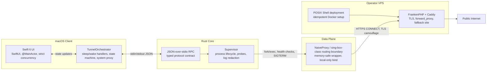

<div align="center">

# Cool Tunnel

**Industrial macOS proxy control plane: Swift 6 orchestration, Rust supervision, NaiveProxy data path, zero analytics.**

[](./LICENSE)
[](https://github.com/coo1white/cool-tunnel/releases/latest)
[](#compatibility)
[](https://github.com/coo1white/cool-tunnel/actions/workflows/ci.yml)
[](./core)
[](./COOL-TUNNEL)

</div>

---

## Repository Metadata

GitHub description, kept under the 160-character repository limit:

> High-performance macOS proxy control plane: Swift 6 UI, Rust supervisor, NaiveProxy data path, zero analytics.

Recommended topics:

`rust` `swift` `swift6` `macos` `macos-app` `macos-proxy` `proxy` `naiveproxy` `sing-box` `caddy` `frankenphp` `docker` `shell` `high-concurrency` `privacy` `anti-tracking` `agplv3`

---

## Operating Posture

Cool Tunnel is not a hosted proxy service. It is a non-custodial macOS client plus hardened operator tooling. The user supplies the server, credentials, domain, and jurisdictional risk assessment.

| Rule | Enforcement |
|---|---|
| **Zero analytics** | No telemetry endpoint, no identity service, no tracking SDK, no event export. |
| **Zero footprint VPS floor** | Server deployment is expected to run on a 1 GB RAM VPS. Anything heavier must justify itself. |
| **Immutable ballast** | Code and docs preserve incident history. Regressions are recorded, not cosmetically erased. |
| **Deterministic release gate** | `scripts/cut_release.sh` runs the local synthetic CI gate before release artifacts leave the tree. |
| **Non-custodial operation** | The repository ships no public servers and no embedded credentials. |

Read [Disclaimer.md](./Disclaimer.md) before use. The software can be used in legally restricted network environments; compliance is the operator's burden.

---

## Architecture Blueprint

Cool Tunnel is built as a three-layer defense system. Each layer has one job. The boundary is intentional: Swift is allowed to orchestrate, Rust is allowed to supervise, the proxy engine is allowed to move packets, and shell is allowed to deploy infrastructure.



### Boundary Contract

| Boundary | Mechanism | Why it exists |
|---|---|---|
| Swift -> Rust | Out-of-process JSON over stdio | A Rust panic terminates a subprocess, not the macOS app. The UI remains state-driven and recoverable. |
| Rust -> proxy engine | Supervised child process | The data plane can be restarted, replaced, SHA-pinned, or killed without corrupting orchestrator state. |
| Client -> VPS | HTTPS CONNECT through NaiveProxy-compatible Caddy | Network observers see ordinary TLS traffic to the operator's own domain. |
| Repo -> release artifact | Shell gate with locked toolchain checks | Local PASS must mean CI PASS: formatter, clippy, tests, ShellCheck, Swift format, binary checks, and release packaging. |

Swift 6 owns lifecycle: window state, menu bar state, system proxy changes, sleep/wake notifications, and strict-concurrency UI updates. Rust owns the hardened control plane: typed protocol handling, process supervision, anomaly detection, local bind enforcement, diagnostics, and credential redaction. The packet router is kept outside the app address space. That separation is the stability model.

There is no FFI bridge. There is no shared memory contract. The JSON schema is the contract; if either side breaks it, tests fail and the process boundary contains the blast radius.

---

## One-Click VPS Installation

### First Scold: Do Not Run This Blind

The server side is infrastructure. Treat it like infrastructure.

| Requirement | Non-negotiable reason |
|---|---|
| Debian VPS, 1 GB RAM minimum | The deployment target is deliberately small. Higher memory is acceptable; lower memory is operator negligence. |
| Root shell or equivalent sudo | The installer owns `/opt/cool-tunnel`, Docker, ports `80` and `443`, and system services. |
| DNS `A` or `AAAA` record already pointed at the VPS | Caddy cannot issue a valid certificate for a domain that does not resolve to the host. |
| Ports `80/tcp`, `443/tcp`, `443/udp` open | ACME, HTTPS CONNECT, and HTTP/3 require these paths. |
| Fresh random credentials | Never reuse examples. Generate with `openssl rand -base64 32`. |

If any prerequisite is false, stop. Fix the host first. A proxy deployed on ambiguous DNS, reused credentials, or a half-open firewall is not a hardened system; it is an incident waiting for a timestamp.

### Then Do Good: Single Operator Command

The checked-in deployment reference is [NaiveProxy_Server_Setup.md](./NaiveProxy_Server_Setup.md). On a fresh VPS, run this as `root` after replacing the domain and email values:

```bash
export CT_DOMAIN="proxy.example.com"
export CT_EMAIL="admin@example.com"
export CT_USER="cool"
export CT_PASSWORD="$(openssl rand -base64 32)"
bash -s <<'EOF'
set -Eeuo pipefail
: "${CT_DOMAIN:?set CT_DOMAIN}"
: "${CT_EMAIL:?set CT_EMAIL}"
: "${CT_USER:?set CT_USER}"
: "${CT_PASSWORD:?set CT_PASSWORD}"

command -v docker >/dev/null 2>&1 || {
  curl -fsSL https://get.docker.com | sh
}

install -d -m 0755 /opt/cool-tunnel/site
cd /opt/cool-tunnel

cat > Dockerfile <<'DOCKER'
FROM caddy:builder AS builder
RUN xcaddy build \
    --with github.com/caddyserver/forwardproxy@caddy2=github.com/klzgrad/forwardproxy@naive
FROM caddy:latest
COPY --from=builder /usr/bin/caddy /usr/bin/caddy
DOCKER

cat > Caddyfile <<CADDY
{
    order forward_proxy before file_server
}

:443, ${CT_DOMAIN} {
    tls ${CT_EMAIL}
    forward_proxy {
        basic_auth ${CT_USER} ${CT_PASSWORD}
        hide_ip
        hide_via
        probe_resistance
    }
    root * /srv
    file_server
}
CADDY

cat > docker-compose.yml <<'COMPOSE'
services:
  cool-tunnel:
    build: .
    container_name: cool-tunnel
    restart: unless-stopped
    ports:
      - "80:80"
      - "443:443"
      - "443:443/udp"
    volumes:
      - ./Caddyfile:/etc/caddy/Caddyfile:ro
      - ./site:/srv:ro
      - naive_caddy_data:/data
      - naive_caddy_config:/config

volumes:
  naive_caddy_data:
  naive_caddy_config:
COMPOSE

printf 'OK\n' > site/index.html
docker compose build --no-cache
docker compose up -d
docker exec cool-tunnel caddy list-modules | grep forward_proxy
printf 'server=%s\nuser=%s\npassword=%s\n' "$CT_DOMAIN" "$CT_USER" "$CT_PASSWORD"
EOF
```

For audit-sensitive operators, the stricter path is:

```bash
git clone https://github.com/coo1white/cool-tunnel.git
cd cool-tunnel
less NaiveProxy_Server_Setup.md
```

Then execute the setup block manually with the same values. The deployment is designed to be idempotent: re-running the Docker/Caddy setup converges the host to the declared state, not parallel services.

### Server Verification

| Check | Command | Expected |
|---|---|---|
| HTTPS fallback | `curl -v https://$CT_DOMAIN` | `OK` from the fallback file server. |
| Caddy module | `docker exec cool-tunnel caddy list-modules | grep forward` | `forward_proxy` module present. |
| Proxy path | `curl -v --proxy "https://$CT_USER:$CT_PASSWORD@$CT_DOMAIN:443" https://ipinfo.io` | Public IP resolves through the VPS. |
| Mac client | `curl -x socks5h://127.0.0.1:1080 -vk --max-time 30 https://www.google.com/generate_204` | `HTTP/2 204` after Cool Tunnel is connected. |

---

## macOS Installation

1. Download the latest `Cool-tunnel-vX.Y.Z.dmg` from [Releases](https://github.com/coo1white/cool-tunnel/releases/latest).
2. Drag `Cool Tunnel.app` into `/Applications`.
3. First launch: right-click -> **Open**. macOS requires this because the project does not depend on Apple's paid Developer ID channel.
4. Enter the VPS domain, username, password, and local port. Keep `1080` unless there is a conflict.
5. Choose routing mode.

| Mode | Use when |
|---|---|
| Smart | Blocked destinations should use the tunnel while ordinary local traffic stays direct. |
| Global | Every TCP connection should route through the configured proxy. |
| Local | Cool Tunnel should only expose `127.0.0.1:1080` and leave system proxy settings untouched. |

---

## Quality Assurance: Heng

Heng means constancy. A release does not ship because the UI looks calm; it ships only after the same failure classes have been forced through the same gates again.

### 1. Sleep / Wake Recovery

With Cool Tunnel connected:

```bash
pmset sleepnow
```

Wake the Mac after roughly 15 seconds.

| Phase | Required behavior |
|---|---|
| `willSleep` | App receives `NSWorkspace.willSleepNotification` and enters pausing state. |
| Sleep checkpoint | Proxy state is made explicit before the machine suspends. |
| `didWake` | App receives `NSWorkspace.didWakeNotification` and begins recovery. |
| Recovery | Orchestrator restarts or reconciles the supervised process. |
| Return to idle | UI returns to connected/ready state within the healthy-uplink budget. |

Failure to recover is a release blocker. Sleep/wake is not a cosmetic feature; it is the normal operating environment of a Mac.

### 2. Error Classification

The classifier must distinguish local failure, upstream failure, and VPS failure. Operators verify by injecting each fault.

| Injection | Expected class | Meaning |
|---|---|---|
| Wrong saved password | Local | Profile, credential, child process, or local firewall defect. |
| Disable all uplinks | Upstream | Wi-Fi, ISP, DNS, captive portal, or general internet path defect. |
| Block VPS `:443` while internet is healthy | VPS | The configured server, TLS endpoint, or proxy daemon is unavailable. |

Misclassification is a product defect. A diagnostic that points to the wrong layer wastes operator time and hides the incident.

### 3. Release Reproducibility

The release gate is the command, not a checklist in someone's memory:

```bash
bash scripts/preflight.sh
bash scripts/cut_release.sh 2.0.36
```

`cut_release.sh` verifies version sync, refreshes the bundled proxy engine, runs the strict audit suite, rebuilds the Rust core and Swift app, runs `security_check.sh`, and packages `.dmg`, `.pkg`, `.zip`, the universal core binary, and the SHA-256 manifest.

---

## Build From Source

### Prerequisites

| Tool | Required |
|---|---|
| Xcode | Xcode with Swift 6 support and macOS 14 SDK or newer. |
| Rust | Toolchain pinned by [core/rust-toolchain.toml](./core/rust-toolchain.toml). |
| `cargo-deny` | `cargo install cargo-deny --locked` |
| `shellcheck` | `brew install shellcheck` |
| `gh` | Optional, only for release publication. |

### Commands

```bash
git clone https://github.com/coo1white/cool-tunnel.git
cd cool-tunnel
bash scripts/preflight.sh
```

For a release build:

```bash
bash scripts/cut_release.sh 2.0.36
```

---

## Security Posture

| Control | Enforcement |
|---|---|
| Credential minimization | Credentials stay local to the user's Mac and selected VPS. |
| Log redaction | Authorization headers, cookies, JSON passwords, and credential-bearing lines are redacted before UI display. |
| Local bind guard | The supervised proxy is expected to bind to loopback only. Public bind anomalies are stopped. |
| SHA-256 update pinning | Updater refuses artifacts whose bytes do not match the manifest. |
| Trusted-host update guard | Update redirects are constrained to GitHub-controlled hosts. |
| Hardened runtime | macOS runtime hardening limits injection and tampering against the app process. |

Cool Tunnel cannot protect against a malicious macOS user process, an unlocked stolen machine, a hostile VPS operator, or a global observer with visibility at both tunnel ends. The server is a trust boundary. Own it accordingly.

Full model: [SECURITY.md](./SECURITY.md).

---

## License and LTSC-Heng Posture

Cool Tunnel is licensed under **AGPL-3.0-only**. The summary below is operational posture, not a replacement for [LICENSE](./LICENSE).

| Axis | Position |
|---|---|
| Copyleft floor | Network service modifications must remain source-available under AGPL terms. |
| Warranty | None. The software is provided as-is, without implied fitness, merchantability, non-infringement, availability, or circumvention efficacy. |
| Liability | Operators carry their own legal, operational, financial, and jurisdictional risk. |
| Commercial use | Services around the software are tolerated; proprietary capture of the software is not. |
| Relicensing | No proprietary fork grant, no CLA aggregation, no open-core conversion path. |
| LTSC-Heng | Maintenance favors long-term corrective releases over feature velocity. Incident history is ballast. |

Commercial support, audits, packaging, and integration work may exist around the project. They do not purchase the right to close the source, hide network-service modifications, or weaken the license.

---

## Compatibility

| Need | Detail |
|---|---|
| macOS | 14 Sonoma or newer. |
| Mac architecture | Apple Silicon and Intel, via universal release artifacts. |
| Installed size | Approximately 45 MB. |
| Runtime memory | Approximately 30 MB on the Mac client. |
| VPS floor | 1 GB RAM Debian host for Docker + Caddy/FrankenPHP-class deployment. |
| Admin password | Not required for normal macOS client operation. |

---

## Maintenance Files

| File | Purpose |
|---|---|
| [CHANGELOG.md](./CHANGELOG.md) | Incident and release history. |
| [SUPPORT.md](./SUPPORT.md) | LTSC support contract. |
| [CONTRIBUTING.md](./CONTRIBUTING.md) | Contributor workflow and local checks. |
| [NaiveProxy_Server_Setup.md](./NaiveProxy_Server_Setup.md) | VPS deployment reference. |
| [Disclaimer.md](./Disclaimer.md) | Legal/operator disclaimer. |
| [NOTICE](./NOTICE) | Third-party attribution, including upstream NaiveProxy. |

<sub>Steward: coolwhite LLC. Posture: non-custodial, hard-copyleft, zero analytics.</sub>
